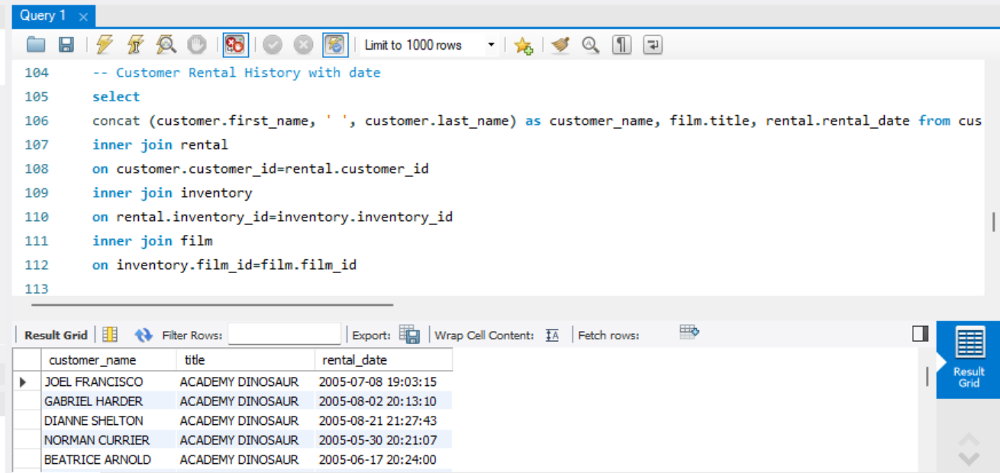

# 🎬 SQL Movie Rental Analysis

## 📌 Project Overview

This project demonstrates the use of **SQL for analyzing movie rental data**. The analysis focuses on retrieving, combining, and exploring information related to customers, movies, rentals, inventory, and rental dates.

The project demonstrates practical SQL querying skills and the ability to transform relational database data into useful business information.

## 🎯 Project Objectives

The main objectives of this project are to:

- Practice SQL queries on relational data
- Retrieve customer and rental information
- Analyze customer rental history
- Combine data from multiple related tables
- Extract movie and rental details
- Develop practical SQL skills for data analysis

## 🖼️ Query Preview

## 🔍 SQL Concepts Demonstrated

The project includes practical use of SQL concepts such as:

- SELECT statements
- INNER JOIN
- Multiple-table joins
- Column aliases
- String concatenation
- Filtering
- Sorting
- Aggregate analysis
- Relational database querying

## 🔗 Customer Rental History Analysis

One of the analyses combines information from multiple database tables to produce customer rental history.

The query connects:

- Customer
- Rental
- Inventory
- Film

The resulting output includes:

- Customer name
- Movie name
- Rental date

This demonstrates how related tables can be joined to produce a more meaningful analytical dataset.

## 🛠️ Tools & Technologies

- SQL
- MySQL
- MySQL Workbench
- Relational Database Analysis
- GitHub

## 👤 Author
Rafijul Islam

Data Analytics & Business Intelligence Enthusiast
Focused on developing skills in SQL, Power BI, data analysis, data visualization, and business intelligence.

www.linkedin.com/in/rafijul-islam-552bb2250
